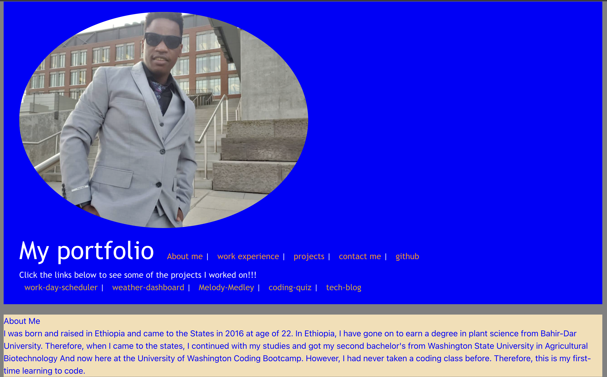
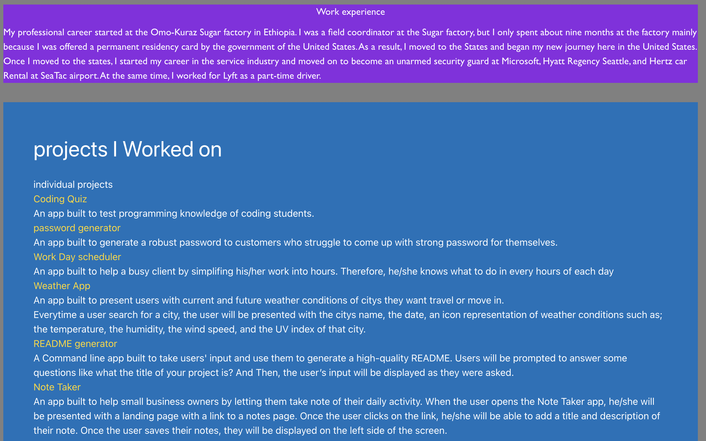
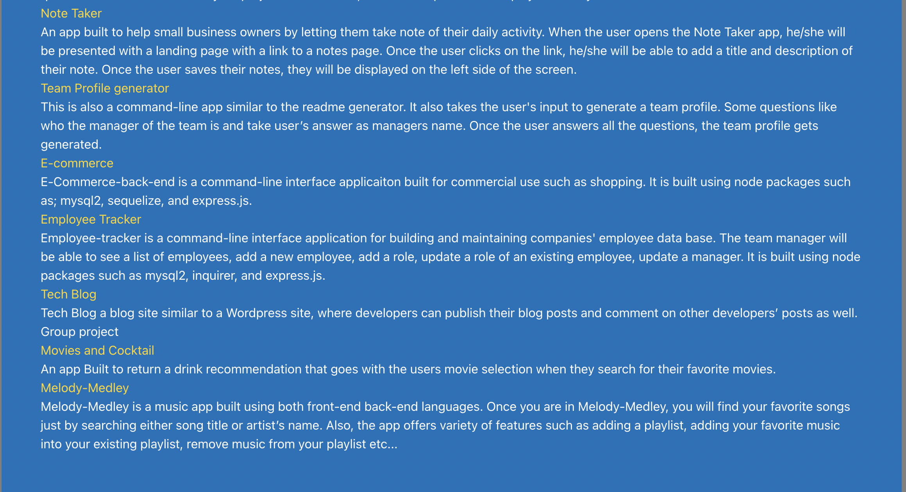
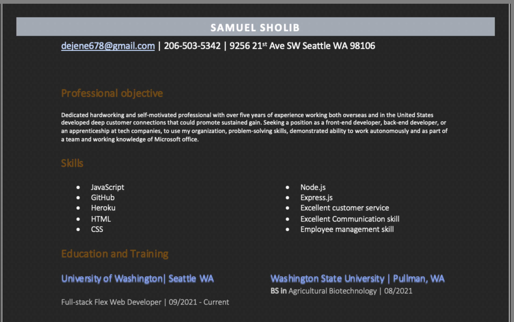
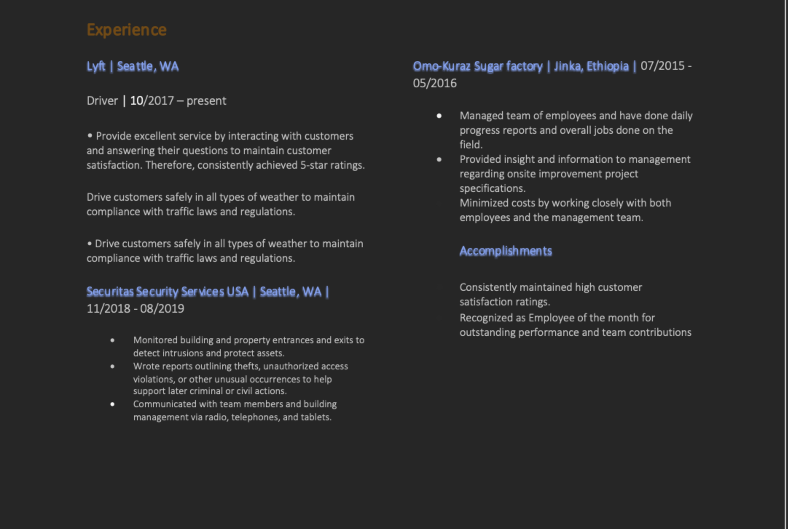
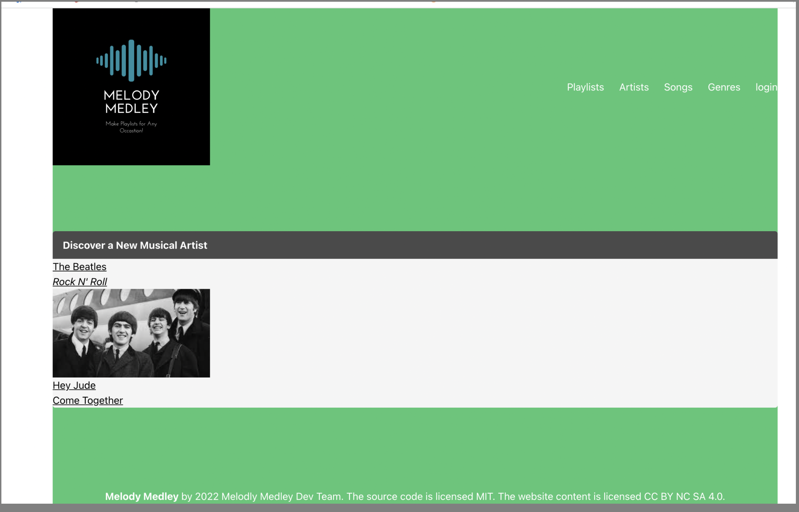
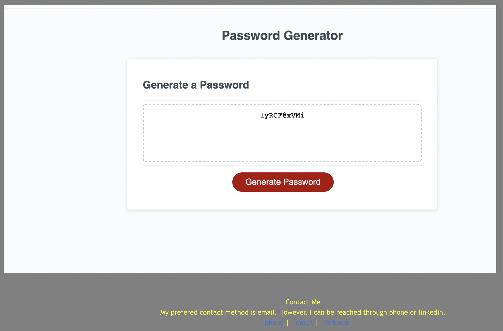

# updated-portfolio-two
This is my updated potpofolio.
It has some informations about me.
As well as my contacts.
And my work experience.
For information checkout my resume in the repo and my linkedin link below.
#Linkedin = https://www.linkedin.com/in/samuel-sholib-2611271b1/
# The live deployed page == https://samuelsholib.github.io/updated-portfolio/
Below, I have added live deployed links to some of the works I have done individually or with group members. Check them out. 
https://samuelsholib.github.io/project-one/

https://samuelsholib.github.io/work-day-scheduler/

https://samuelsholib.github.io/weather-map-Api/

 https://samuelsholib.github.io/code-quiz/

;

;

;

;

;

;

;

=======
