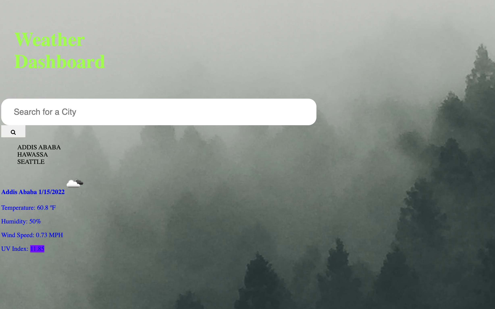

# updated-portfolio-two
This is my updated potpofolio.
It has some informations about me.
As well as my contacts.
And my work experience.
For information checkout my resume in the repo and my linkedin link below.
#Linkedin = https://www.linkedin.com/in/samuel-sholib-2611271b1/
The live deployed page will be found here https://samuelsholib.github.io/updated-portfolio/
Below, I have added  deployed links to some of the works I have done individually and  with group members. Check them out. 

## Coding quiz

## Weather dashboard

## Melody Medley

Thank you for going through my readme!!!
